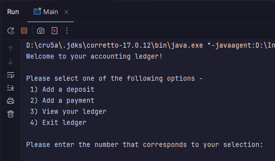
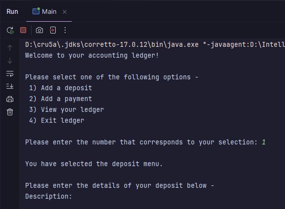
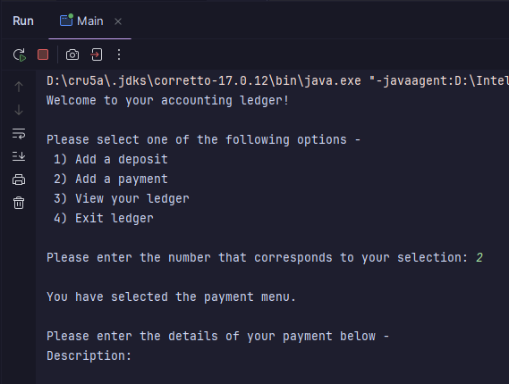
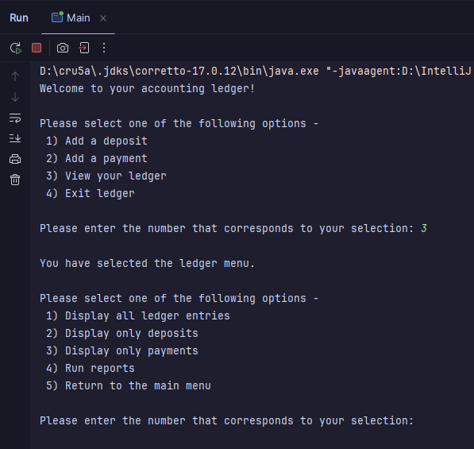
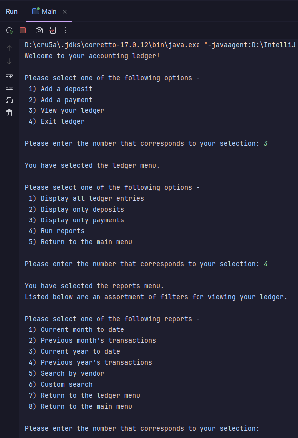
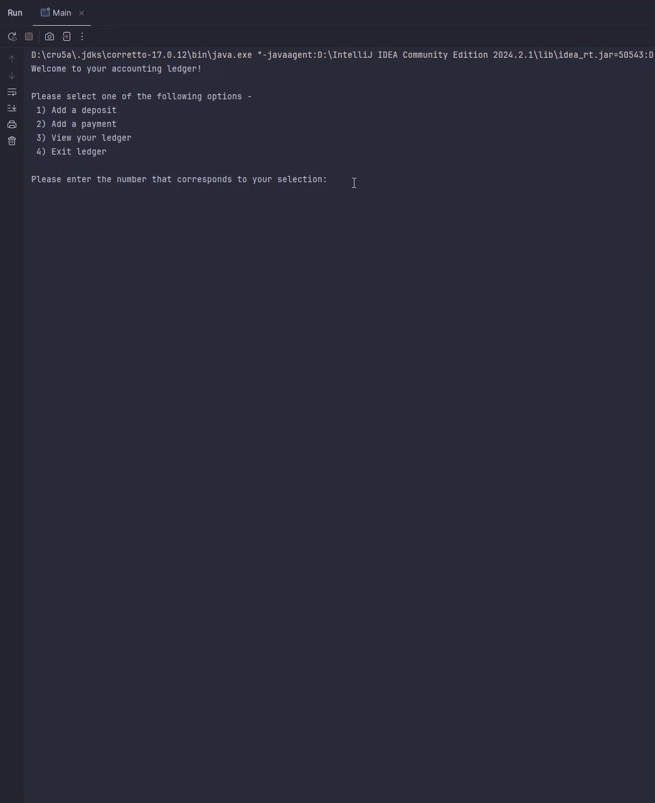
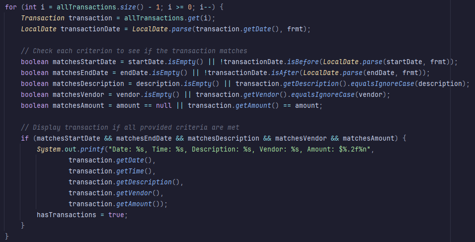

# Accounting Ledger Application

## Overview

This application is designed to help users track their financial transactions, including both payments and deposits, by 
managing them within a ledger. The application is written in Java and provides an easy-to-use, console-based interface for 
viewing, adding, and filtering transactions. Users can generate reports, search for transactions by vendor, and display entries by date range.

## Features

### Transaction Management
- Track both payments and deposits within a centralized ledger.
- Entries displayed in reverse chronological order for easy access.

### Reporting
- Generate reports for the current month, previous month, current year, and previous year.
- Options for vendor-based search and custom searches.

### User Experience
- Intuitive console-based navigation for effortless interaction.
- Automatic generation of date and time for new entries.

### Input Validation
- Basic checks to ensure user inputs are valid, minimizing errors.

## Project Structure

### Main Class
- Manages menu navigation and interactions with the ledger.
- Includes methods for displaying and filtering ledger entries, managing reports, and executing custom searches.

### Transaction Class
- Encapsulates properties of a transaction: date, time, description, vendor, and amount.
- Provides getter and setter methods, along with an overridden `toString()` method for formatted output.

### CSV File
- Stores transaction data in a pipe-separated values format, allowing for easy reading and writing of entries.
- The application reads from and writes to this file to maintain persistent records of all transactions.

## Usage Instructions

### Main Menu Options
- Navigate the main menu to view or filter transactions and generate reports. Each option is clearly labeled for intuitive interaction.

### Adding Transactions
- Follow prompts to enter transaction details. The application automatically sets the amount as positive for deposits and negative for payments, generating the current date and time for new entries.

### Viewing Transactions
- Access filtered views of your ledger, including options to display all transactions, view by category (deposits or payments), or generate reports for specific time frames.

### Error Handling
- The application includes basic input validation to manage common errors, such as non-numeric values for menu selections, ensuring a smoother user experience.

## Screenshots

Below are screenshots showcasing the different menus of the Accounting Ledger Application, along with a GIF demonstrating the display of all transactions.

### Main Menu


### Deposit Menu


### Payment Menu


### Ledger Menu


### Reports Submenu


### Display All Transactions


## Notable Code

### Custom Search Method Boolean Logic


This section highlights the boolean logic in the `customSearch` method, enabling flexible filtering of transactions based on user-defined criteria.

- **Date Matching**: The method validates transaction dates against user-provided start and end dates. If a user specifies a date, the transaction must fall within the range; if the field is left blank, all dates are accepted:
    ```java
    boolean matchesStartDate = startDate.isEmpty() || !transactionDate.isBefore(LocalDate.parse(startDate, frmt));
    boolean matchesEndDate = endDate.isEmpty() || !transactionDate.isAfter(LocalDate.parse(endDate, frmt));
    ```

- **Other Criteria Matching**: For description, vendor, and amount, the logic checks if the corresponding fields match the transaction data or if the fields are left blank, allowing all entries to pass through:
    ```java
    boolean matchesDescription = description.isEmpty() || transaction.getDescription().equalsIgnoreCase(description);
    boolean matchesVendor = vendor.isEmpty() || transaction.getVendor().equalsIgnoreCase(vendor);
    boolean matchesAmount = amount == null || transaction.getAmount() == amount;
    ```

The transaction is displayed only if all criteria are met, providing a robust and user-friendly search capability.
